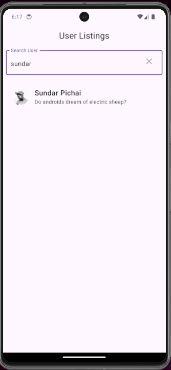
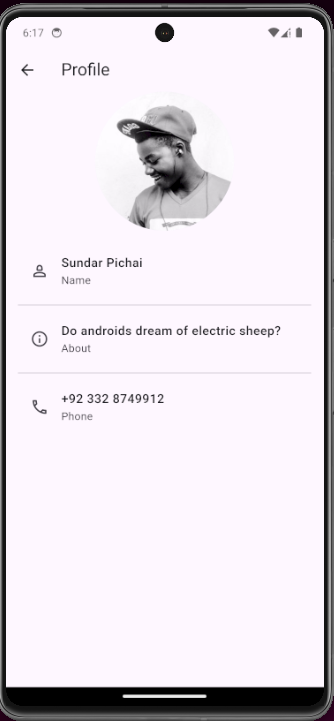

# lecture_5

Lecture#5 of the Flutter GDSC Summer Camp 2024.

## Topics Covered

* Dart Asynchronous Programming
* Understanding REST APIs
* Using HTTP package
* Data Models & JSON
* FutureBuilder

## Links

- [Video Recording](https://colorlib.com/wp/wp-content/uploads/sites/2/ComingSoon_v4.jpg)

## Author

- [Saad Bin Khalid](https://saadbinkhalid.com)
- [Muhammad Umar Orakzai](mailto:k224084@nu.edu.pk)

# Screenshots

## Searching for User

## Profile (User Details)

